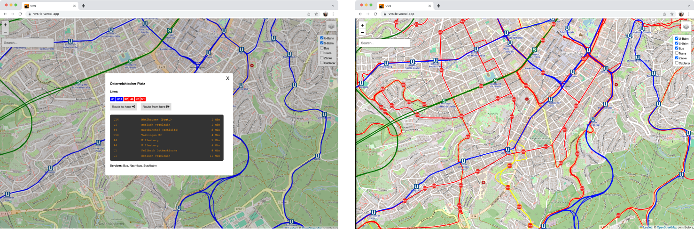
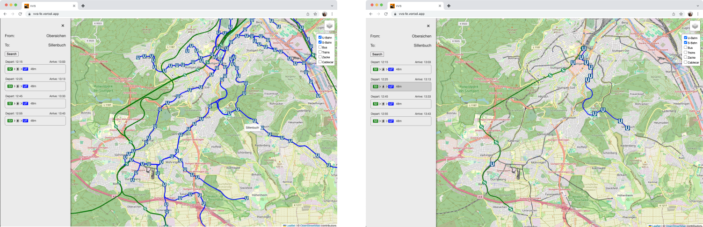

#  Stuttgart Transport Explorer Frontend

Hobby project that aims to explore and visualize the extensive transport services provided by VVS (Verkehrs- und Tarifverbund Stuttgart) in the Stuttgart region. 
By leveraging interactive maps and real-time data, the application offers users a way to navigate the public transportation network. 
Key features include detailed route search between stops, visualization of transport lines and stations, and information on arrivals and departures. 

Currently, being developed

**You can find demo here**: [transport-explorer.vercel.app](https://transport-explorer.vercel.app/)

## Features

### Line and station Information
The application features an interactive map displaying detailed line and station information for the public transportation system. Key highlights include:

- Map Visualization: The map showcases various transport lines (U-Bahn, S-Bahn, Bus, Trains, Zacke, Cablecar (Seilbahn)) with distinct colors and icons for easy differentiation.
- Interactive Filters: Users can toggle the visibility of different transport modes using checkboxes, allowing for a customized view.
- Station Markers: Each station is marked with a clear icon, and clicking on a station reveals additional information, such as the station name and connected lines.
- Line Details: The lines are plotted on the map, showing the routes they follow and connecting the corresponding stations.

### Route Search
The application provides a comprehensive route search feature that allows users to find the best routes between two stops. Key features include:

- Journey Options: The application displays multiple journey options, each detailing the departure and arrival times, total travel duration, and the transport lines involved.
- Map Visualization: The selected route is clearly plotted on the map, showing the exact path and connections between the stops.
- Interactive Elements: Users can toggle between different transport modes using the filters to customize the view and see the available routes for the selected transport modes.
- Detailed Information: Each journey option provides detailed information about the lines and stops, helping users choose the most convenient route.

## Contributing

Contributions are welcome! If you have any improvements, bug fixes, or new features, feel free to submit a pull request. 

## License

This project is licensed under the MIT License. See the [LICENSE](LICENSE) file for more details.

## Contact

If you have any questions, suggestions, or feedback, please reach out to us:

- Email: [contact@ownerofglory.com](mailto:contact@ownerofglory.com)

## Acknowledgements

We would like to thank the following resources and contributors:

- [VVS Stuttgart](https://www.vvs.de/) for providing transport data.
- [Leaflet](https://leafletjs.com/) for the mapping library.
- [OpenStreetMap](https://www.openstreetmap.org/) for map data.
- [Geofabrik](https://www.geofabrik.de/) for vector map data

Thank you for using Transport Explorer! We hope you find it useful and informative.

---

*Happy exploring!*
